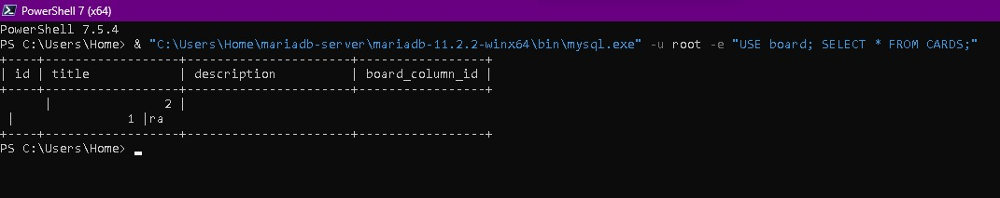

# OlloApp Board Manager 🚀

Este é um sistema de gerenciamento de tarefas baseado no método **Kanban**, desenvolvido em **Java 21** com persistência em banco de dados **MariaDB**. O projeto faz parte do ecossistema **Ollo** e foi construído como um desafio técnico para a **Digital Innovation One (DIO)**.

---

## 📸 Demonstração do Sistema

Para validar o funcionamento, as capturas abaixo mostram a interface via terminal e a integridade dos dados no banco:

**1. Interface de Gerenciamento (Terminal)**
Visualização do menu e do status das colunas do board.


**2. Persistência de Dados (MariaDB)**
Consulta direta no banco comprovando que os dados estão salvos.


---

## 🛠️ Tecnologias Utilizadas

- **Java 21** - Linguagem principal (JDK Microsoft).
- **MariaDB 11.2** - Banco de dados relacional.
- **JDBC** - Tecnologia para conexão com o banco.
- **Gradle** - Automação e gerenciamento de dependências.

---

## 🚀 Como Executar

### Pré-requisitos
- Java 21 instalado.
- MariaDB rodando localmente.
- Banco de dados chamado `board` criado.

### Passos para rodar:

1. **Clone o repositório**
```bash
git clone [https://github.com/Thiago-spba/olloapp-board-manager.git](https://github.com/Thiago-spba/olloapp-board-manager.git)
cd olloapp-board-manager
